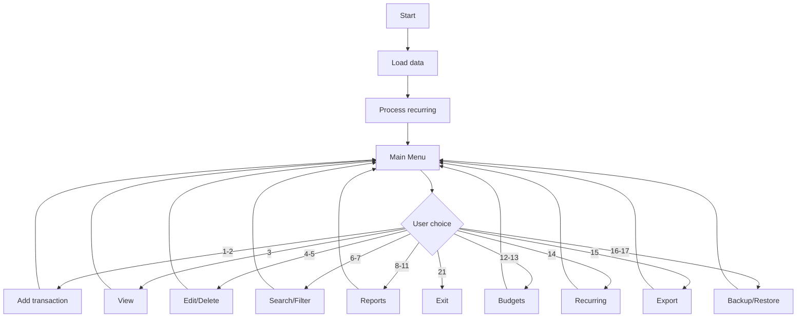
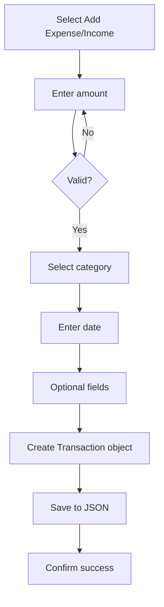
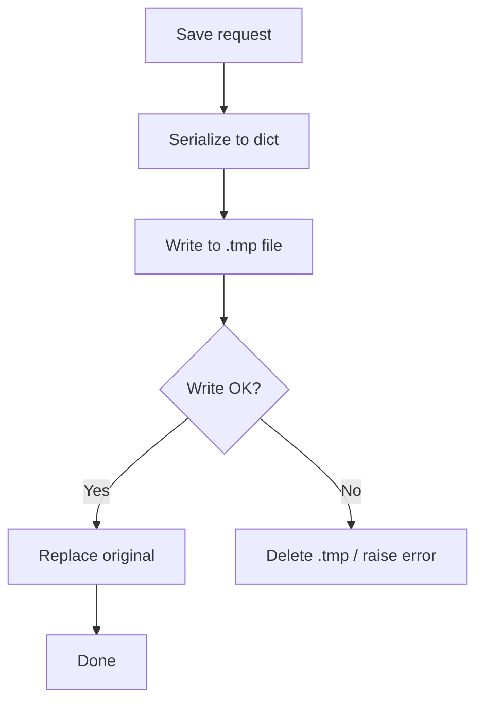
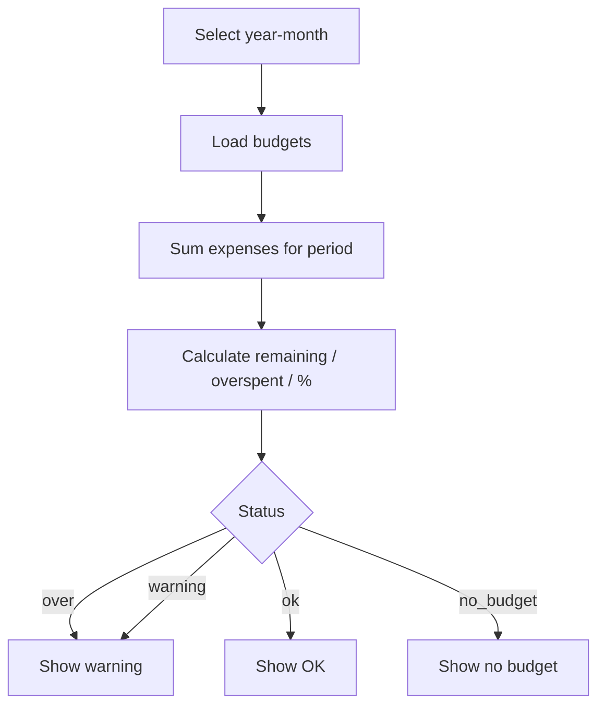
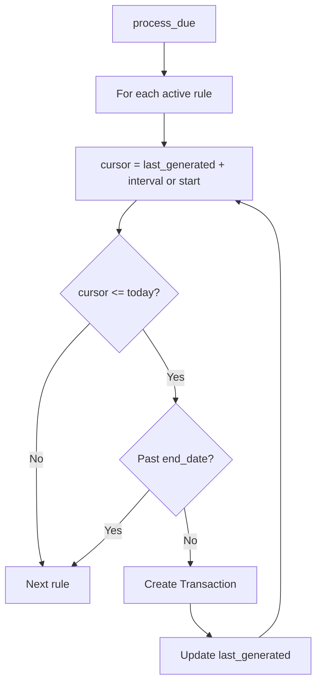

# Flowcharts (Mermaid)

## Application Workflow

```mermaid
flowchart TD
    A[Start] --> B[Load data]
    B --> C[Process recurring]
    C --> D[Main Menu]
    D --> E{User choice}
    E -->|1-2| F[Add transaction]
    E -->|3| G[View]
    E -->|4-5| H[Edit/Delete]
    E -->|6-7| I[Search/Filter]
    E -->|8-11| J[Reports]
    E -->|12-13| K[Budgets]
    E -->|14| L[Recurring]
    E -->|15| M[Export]
    E -->|16-17| N[Backup/Restore]
    E -->|21| O[Exit]
    F --> D
    G --> D
    H --> D
    I --> D
    J --> D
    K --> D
    L --> D
    M --> D
    N --> D
```

## Adding a Transaction

```mermaid
flowchart TD
    A[Select Add Expense/Income] --> B[Enter amount]
    B --> C{Valid?}
    C -->|No| B
    C -->|Yes| D[Select category]
    D --> E[Enter date]
    E --> F[Optional fields]
    F --> G[Create Transaction object]
    G --> H[Save to JSON]
    H --> I[Confirm success]
```

## Saving and Loading Data

```mermaid
flowchart TD
    A[Save request] --> B[Serialize to dict]
    B --> C[Write to .tmp file]
    C --> D{Write OK?}
    D -->|Yes| E[Replace original]
    D -->|No| F[Delete .tmp / raise error]
    E --> G[Done]
```

## Budget Status

```mermaid
flowchart TD
    A[Select year-month] --> B[Load budgets]
    B --> C[Sum expenses for period]
    C --> D[Calculate remaining / overspent / %]
    D --> E{Status}
    E -->|over| F[Show warning]
    E -->|warning| F
    E -->|ok| G[Show OK]
    E -->|no_budget| H[Show no budget]
```

## Recurring Processing

```mermaid
flowchart TD
    A[process_due] --> B[For each active rule]
    B --> C[cursor = last_generated + interval or start]
    C --> D{cursor <= today?}
    D -->|No| E[Next rule]
    D -->|Yes| F{Past end_date?}
    F -->|Yes| E
    F -->|No| G[Create Transaction]
    G --> H[Update last_generated]
    H --> C
```
